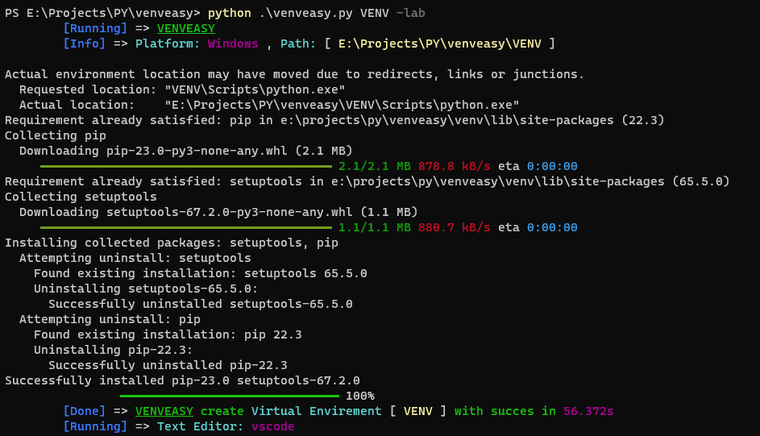

# venveasy
Python script to create virtual envirements
```console
whybe@YB:~$ python ./venveasy.py my-venv
```
you can also use it with the flage `-lab` to open your text editor in the virtual env dir
the `-lab` only support "Vscode", "sublime text", "atom".

```console
whybe@YB:~$ python ./venveasy.py my-venv -lab
```

## screenshots:


